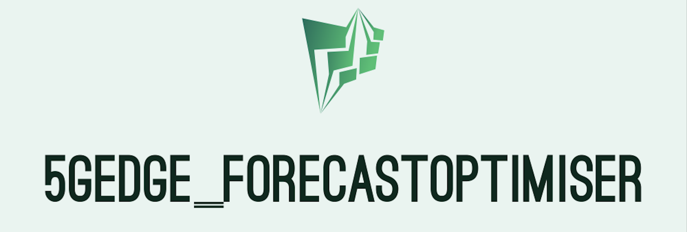

# ForecastOptimiser


<p align="center">
  
</p>

>This is the implentation of the ForecastOptimiser for [TARGETX](https://target-x.eu) first Open Call. (C) Lamda Networks, www.lamdanetworks.io     
## ⚙ Setup locally

**Prerequisites**: A Kubernetes deployment and devops tools like kubectl and helm

After cloning the repository, there is 1 more step to do. 

```bash
cd ForecastOptimiser/

helm install target-helm targetx-helm -n <your K8s namespace> #where <your K8s namespace> is created by kubectl create ns <your K8s namespace>

```

### How to use the application  

After the containers are up and running:

 - Obtain the < IP > address of the entrypoint service (nginx-service) with kubectl get svc nginx-ingress -o yaml -n <your K8s namespace> | grep ip
 - access the application at: (http://< IP >)
 - login to the admin dashboard at: (http://< IP >)
     - Default credentials: `admin` / `targetx`
     - The credentials can be changed inside pvapp/frontend/src/Home.tsx and then the image frontend needs to be built (lines 11 and 12 of the create-containers.sh script)
   - Add your domain certificate in the src/nginx.conf to enable SSL for your domain name.


>\* 💡 Info: *To build all images from their source code, you need to run sh create-containers.sh.*

> \*\* 💡 Info: *To train your models using your own data (this repo does not contain the files we used for training as they are proprietary to TARGETX project) you should you need to add the raw data in folder powerData. You will also need to obtain the file trainer.py which provides data cleansing functionality. Contact forecastoptimiser AT lamdanetwork.io for this. 

